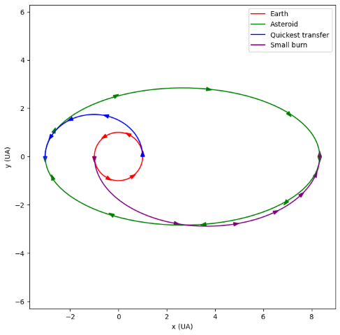
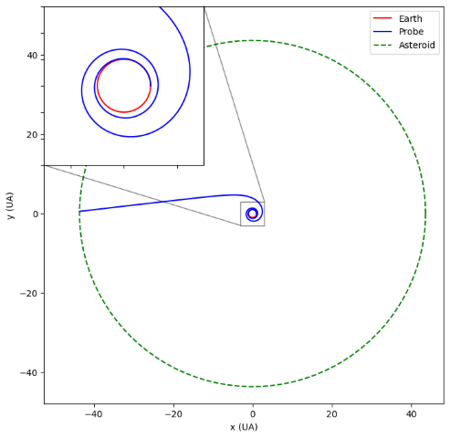

# Space dynamics workbooks

This repos contains all the code and notebooks from the 6PAM0027 Space Dynamics module at the University of Hertfordshire, UK.

It contains python notebooks convering space dynamics and basic mechanic topics (like spin and inertia). The final PDF with all the workbooks concatenated can be found [here](./WEFULL.pdf).

## Dependencies

To generate PDF report from python workbook it is important to have the following:
- [Pandoc](https://pandoc.org/)
- [MikTex](https://miktex.org/)

## Some figures examples

### 3D Atmospheric drag

### Transfer to an asteroid

### Spin ellipsoid (stability of motion)

### Continuous burn

### Faster Moon transfer

